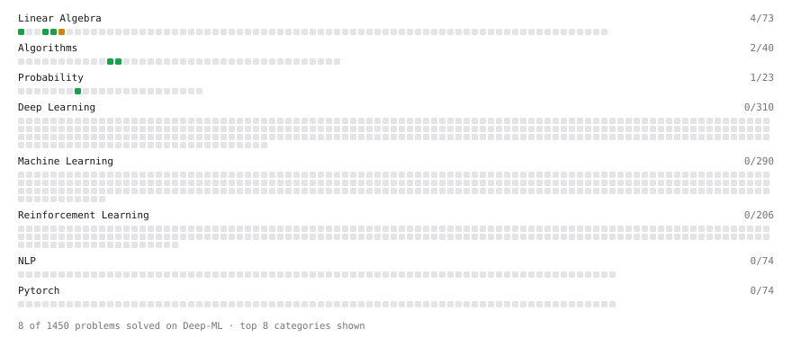

# Deep-ML

My machine learning practice from [Deep-ML](https://www.deep-ml.com). Every solution here was written by hand.

**14** solved · 14 problems · 0 labs · 0 math

[**Browse the interactive portfolio**](https://sv1120.github.io/deep-ml/) to replay this filling in over time.

## Problems

| | Difficulty | Solved | |
| --- | --- | --- | --- |
| [Calculate 2x2 Matrix Inverse](https://www.deep-ml.com/problems/8) | easy | 2026-09-25 | [solution](problems/0008-calculate-2x2-matrix-inverse) |
| [Calculate Covariance Matrix](https://www.deep-ml.com/problems/10) | easy | 2026-09-25 | [solution](problems/0010-calculate-covariance-matrix) |
| [Calculate Image Brightness](https://www.deep-ml.com/problems/70) | easy | 2026-09-25 | [solution](problems/0070-calculate-image-brightness) |
| [Calculate Mean by Row or Column](https://www.deep-ml.com/problems/4) | easy | 2026-09-24 | [solution](problems/0004-calculate-mean-by-row-or-column) |
| [Count Words Appearing Exactly Once in Each of Two Lists](https://www.deep-ml.com/problems/1141) | easy | 2026-09-24 | [solution](problems/1141-count-words-appearing-exactly-once-in-each-of-two-lists) |
| [Derivative of a Polynomial](https://www.deep-ml.com/problems/116) | easy | 2026-09-24 | [solution](problems/0116-derivative-of-a-polynomial) |
| [Expected Value and Variance of an n-Sided Die](https://www.deep-ml.com/problems/179) | easy | 2026-09-24 | [solution](problems/0179-expected-value-and-variance-of-an-n-sided-die) |
| [First N Fibonacci Numbers](https://www.deep-ml.com/problems/1151) | easy | 2026-09-24 | [solution](problems/1151-first-n-fibonacci-numbers) |
| [Matrix-Vector Dot Product](https://www.deep-ml.com/problems/1) | easy | 2026-09-24 | [solution](problems/0001-matrix-vector-dot-product) |
| [Scalar Multiplication of a Matrix](https://www.deep-ml.com/problems/5) | easy | 2026-09-24 | [solution](problems/0005-scalar-multiplication-of-a-matrix) |
| [Top-K Largest Elements in a List](https://www.deep-ml.com/problems/1137) | easy | 2026-09-24 | [solution](problems/1137-top-k-largest-elements-in-a-list) |
| [Transpose of a Matrix](https://www.deep-ml.com/problems/2) | easy | 2026-09-25 | [solution](problems/0002-transpose-of-a-matrix) |
| [Valid Palindrome II (Delete At Most One Char)](https://www.deep-ml.com/problems/1160) | easy | 2026-09-24 | [solution](problems/1160-valid-palindrome-ii-delete-at-most-one-char) |
| [Calculate Eigenvalues of a Matrix](https://www.deep-ml.com/problems/6) | medium | 2026-09-24 | [solution](problems/0006-calculate-eigenvalues-of-a-matrix) |

---

_This file is regenerated by Deep-ML on every push._
