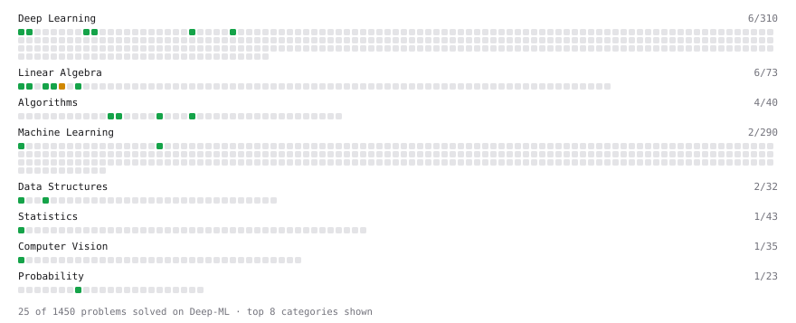

# Deep-ML

My machine learning practice from [Deep-ML](https://www.deep-ml.com). Every solution here was written by hand.

**55** solved · 55 problems · 0 labs · 0 math

[**Browse the interactive portfolio**](https://sv1120.github.io/deep-ml/) to replay this filling in over time.

## Problems

| | Difficulty | Solved | |
| --- | --- | --- | --- |
| [Calculate 2x2 Matrix Inverse](https://www.deep-ml.com/problems/8) | easy | 2026-09-25 | [solution](problems/0008-calculate-2x2-matrix-inverse) |
| [Calculate Accuracy Score](https://www.deep-ml.com/problems/36) | easy | 2026-09-27 | [solution](problems/0036-calculate-accuracy-score) |
| [Calculate Cosine Similarity Between Vectors](https://www.deep-ml.com/problems/76) | easy | 2026-09-30 | [solution](problems/0076-calculate-cosine-similarity-between-vectors) |
| [Calculate Covariance Matrix](https://www.deep-ml.com/problems/10) | easy | 2026-09-25 | [solution](problems/0010-calculate-covariance-matrix) |
| [Calculate Image Brightness](https://www.deep-ml.com/problems/70) | easy | 2026-09-25 | [solution](problems/0070-calculate-image-brightness) |
| [Calculate Jaccard Index for Binary Classification](https://www.deep-ml.com/problems/72) | easy | 2026-09-27 | [solution](problems/0072-calculate-jaccard-index-for-binary-classification) |
| [Calculate Mean Absolute Error (MAE)](https://www.deep-ml.com/problems/93) | easy | 2026-09-27 | [solution](problems/0093-calculate-mean-absolute-error-mae) |
| [Calculate Mean by Row or Column](https://www.deep-ml.com/problems/4) | easy | 2026-09-24 | [solution](problems/0004-calculate-mean-by-row-or-column) |
| [Calculate Portfolio Variance](https://www.deep-ml.com/problems/183) | easy | 2026-09-26 | [solution](problems/0183-calculate-portfolio-variance) |
| [Calculate R-squared for Regression Analysis](https://www.deep-ml.com/problems/69) | easy | 2026-09-27 | [solution](problems/0069-calculate-r-squared-for-regression-analysis) |
| [Calculate Root Mean Square Error (RMSE)](https://www.deep-ml.com/problems/71) | easy | 2026-09-27 | [solution](problems/0071-calculate-root-mean-square-error-rmse) |
| [Compute TPR and FPR from Classifications](https://www.deep-ml.com/problems/1217) | easy | 2026-09-27 | [solution](problems/1217-compute-tpr-and-fpr-from-classifications) |
| [Convert Vector to Diagonal Matrix](https://www.deep-ml.com/problems/35) | easy | 2026-09-27 | [solution](problems/0035-convert-vector-to-diagonal-matrix) |
| [Count Words Appearing Exactly Once in Each of Two Lists](https://www.deep-ml.com/problems/1141) | easy | 2026-09-24 | [solution](problems/1141-count-words-appearing-exactly-once-in-each-of-two-lists) |
| [Create and Inspect a Tensor](https://www.deep-ml.com/problems/1220) | easy | 2026-10-01 | [solution](problems/1220-create-and-inspect-a-tensor) |
| [Demonstrate Law of Large Numbers with Sampling](https://www.deep-ml.com/problems/342) | easy | 2026-10-01 | [solution](problems/0342-demonstrate-law-of-large-numbers-with-sampling) |
| [Derivative of a Polynomial](https://www.deep-ml.com/problems/116) | easy | 2026-09-24 | [solution](problems/0116-derivative-of-a-polynomial) |
| [Detect Overfitting or Underfitting](https://www.deep-ml.com/problems/86) | easy | 2026-09-27 | [solution](problems/0086-detect-overfitting-or-underfitting) |
| [Dot Product Calculator](https://www.deep-ml.com/problems/83) | easy | 2026-09-27 | [solution](problems/0083-dot-product-calculator) |
| [Expected Value and Variance of an n-Sided Die](https://www.deep-ml.com/problems/179) | easy | 2026-09-24 | [solution](problems/0179-expected-value-and-variance-of-an-n-sided-die) |
| [Exponential Distribution PDF and CDF](https://www.deep-ml.com/problems/340) | easy | 2026-10-01 | [solution](problems/0340-exponential-distribution-pdf-and-cdf) |
| [First N Fibonacci Numbers](https://www.deep-ml.com/problems/1151) | easy | 2026-09-24 | [solution](problems/1151-first-n-fibonacci-numbers) |
| [Hamming Distance for Kanerva Coding](https://www.deep-ml.com/problems/647) | easy | 2026-09-27 | [solution](problems/0647-hamming-distance-for-kanerva-coding) |
| [Implement Gini Impurity Calculation for a Set of Classes](https://www.deep-ml.com/problems/64) | easy | 2026-10-01 | [solution](problems/0064-implement-gini-impurity-calculation-for-a-set-of-classes) |
| [Implement Precision Metric](https://www.deep-ml.com/problems/46) | easy | 2026-09-27 | [solution](problems/0046-implement-precision-metric) |
| [Implement Recall Metric in Binary Classification](https://www.deep-ml.com/problems/52) | easy | 2026-10-01 | [solution](problems/0052-implement-recall-metric-in-binary-classification) |
| [Implement ReLU Activation Function](https://www.deep-ml.com/problems/42) | easy | 2026-09-26 | [solution](problems/0042-implement-relu-activation-function) |
| [Implement Ridge Regression Loss Function](https://www.deep-ml.com/problems/43) | easy | 2026-09-27 | [solution](problems/0043-implement-ridge-regression-loss-function) |
| [Implement the ELU Activation Function](https://www.deep-ml.com/problems/97) | easy | 2026-09-27 | [solution](problems/0097-implement-the-elu-activation-function) |
| [Implement the Hard Sigmoid Activation Function](https://www.deep-ml.com/problems/96) | easy | 2026-09-30 | [solution](problems/0096-implement-the-hard-sigmoid-activation-function) |
| [Implement the SELU Activation Function](https://www.deep-ml.com/problems/103) | easy | 2026-09-27 | [solution](problems/0103-implement-the-selu-activation-function) |
| [Implement the Softplus Activation Function](https://www.deep-ml.com/problems/99) | easy | 2026-09-30 | [solution](problems/0099-implement-the-softplus-activation-function) |
| [Implement the Softsign Activation Function](https://www.deep-ml.com/problems/100) | easy | 2026-09-30 | [solution](problems/0100-implement-the-softsign-activation-function) |
| [Implement the Swish Activation Function](https://www.deep-ml.com/problems/102) | easy | 2026-09-30 | [solution](problems/0102-implement-the-swish-activation-function) |
| [Implementation of Log Softmax Function](https://www.deep-ml.com/problems/39) | easy | 2026-09-30 | [solution](problems/0039-implementation-of-log-softmax-function) |
| [Label Encoding for Ordinal Variables](https://www.deep-ml.com/problems/356) | easy | 2026-09-27 | [solution](problems/0356-label-encoding-for-ordinal-variables) |
| [Leaky ReLU Activation Function](https://www.deep-ml.com/problems/44) | easy | 2026-09-27 | [solution](problems/0044-leaky-relu-activation-function) |
| [Linear Kernel Function](https://www.deep-ml.com/problems/45) | easy | 2026-09-27 | [solution](problems/0045-linear-kernel-function) |
| [Linear Learning Rate Decay](https://www.deep-ml.com/problems/377) | easy | 2026-10-01 | [solution](problems/0377-linear-learning-rate-decay) |
| [Linear Regression Using Normal Equation](https://www.deep-ml.com/problems/14) | easy | 2026-09-27 | [solution](problems/0014-linear-regression-using-normal-equation) |
| [Matrix-Vector Dot Product](https://www.deep-ml.com/problems/1) | easy | 2026-09-24 | [solution](problems/0001-matrix-vector-dot-product) |
| [Mean Squared Error from Scratch](https://www.deep-ml.com/problems/1228) | easy | 2026-10-01 | [solution](problems/1228-mean-squared-error-from-scratch) |
| [Measure Disorder in Apple Colors](https://www.deep-ml.com/problems/108) | easy | 2026-09-30 | [solution](problems/0108-measure-disorder-in-apple-colors) |
| [Min-Max Scaling of Feature Values](https://www.deep-ml.com/problems/112) | easy | 2026-09-27 | [solution](problems/0112-min-max-scaling-of-feature-values) |
| [One SGD Update Step](https://www.deep-ml.com/problems/1234) | easy | 2026-10-01 | [solution](problems/1234-one-sgd-update-step) |
| [Reshape Matrix](https://www.deep-ml.com/problems/3) | easy | 2026-09-30 | [solution](problems/0003-reshape-matrix) |
| [Scalar Multiplication of a Matrix](https://www.deep-ml.com/problems/5) | easy | 2026-09-24 | [solution](problems/0005-scalar-multiplication-of-a-matrix) |
| [Sigmoid Activation Function Understanding](https://www.deep-ml.com/problems/22) | easy | 2026-09-26 | [solution](problems/0022-sigmoid-activation-function-understanding) |
| [Softmax Activation Function Implementation ](https://www.deep-ml.com/problems/23) | easy | 2026-09-27 | [solution](problems/0023-softmax-activation-function-implementation) |
| [Top-K Largest Elements in a List](https://www.deep-ml.com/problems/1137) | easy | 2026-09-24 | [solution](problems/1137-top-k-largest-elements-in-a-list) |
| [Transpose of a Matrix](https://www.deep-ml.com/problems/2) | easy | 2026-09-25 | [solution](problems/0002-transpose-of-a-matrix) |
| [Valid Palindrome II (Delete At Most One Char)](https://www.deep-ml.com/problems/1160) | easy | 2026-09-24 | [solution](problems/1160-valid-palindrome-ii-delete-at-most-one-char) |
| [Vector Element-wise Sum](https://www.deep-ml.com/problems/121) | easy | 2026-09-27 | [solution](problems/0121-vector-element-wise-sum) |
| [Calculate Eigenvalues of a Matrix](https://www.deep-ml.com/problems/6) | medium | 2026-09-24 | [solution](problems/0006-calculate-eigenvalues-of-a-matrix) |
| [Matrix times Matrix ](https://www.deep-ml.com/problems/9) | medium | 2026-09-27 | [solution](problems/0009-matrix-times-matrix) |

---

_This file is regenerated by Deep-ML on every push._
